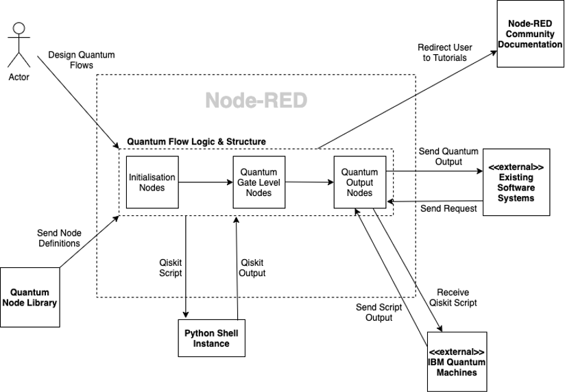
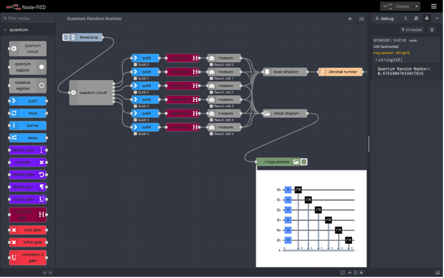

## What is Node-RED Quantum?
Node-RED Quantum is a library which allows users to build quantum circuits visually using
the Node-RED platform. This project is intended to bring quantum functionality to Node-RED,
with the goal of improving the accessibility of quantum computing for non-specialists by
providing a means of learning and utilising the power of quantum computing, without needing
to write code or understand its intricate complexities. By making it easier for people to use
quantum computing, the aim is to remove the barrier to entry and open up the possibility for
wider use and adoption of quantum computing.

Though there is a focus on making quantum computing more accessible to novice users,
there are also benefits to quantum specialists in using Node-RED Quantum, as well as for
developers who would like to optimise their own classical programs with the power of quantum
computing. Being able to visually create large scale quantum circuits and receive the result
from IBM quantum machines via Node-RED is useful even for experts, as wiring nodes
through a drag-and-drop interface can often prove to be less complex, faster, and more
productive than writing the equivalent code. Moreover, by using HTTP requests and the
relevant nodes, developers can trigger quantum flows from their external classical systems and
receive the resulting quantum output for use in their classical programs. Hence, allowing more
people to benefit from the power of quantum computing, regardless of their experience with
quantum or their goals - whether it be education, optimisation, or research. 

## What Was Node-RED Quantum Built From?
Node-RED Quantum is the product of combining two key technologies: Node-RED and Qiskit.

[Node-RED](https://nodered.org/) is an open source, flow-based development environment which runs in the browser
and allows users to create visual representations of programs by dragging and dropping nodes
and connecting them together to form flows. Each node in Node-RED encapsulates JavaScript
code that implements particular functionality. Node-RED abstracts away the code complexities
and allows users to build programs as flows, hence removing the need for users to have
programming expertise.

[Qiskit](qiskit.org) is a Python-based software development kit that provides tools for developing quantum
programs and running them on quantum machines or simulators. Using Qiskit, developers can
write programs which manipulate the qubits on the [IBM Quantum](https://quantum-computing.ibm.com/) qubit machines and form quantum programs for solving difficult computational problems.

## How Does Node-RED Quantum Work?
In the simplest terms, Node-RED Quantum acts as a wrapper for Qiskit code. Using the
quantum nodes creates a Qiskit script equivalent to the visual representation of the flow, which
is executed in a Python shell instance. This is illustrated in the diagram below.

The Node-RED Quantum library contains definitions for each node, which dictate how they
will be visually represented in Node-RED and the functionality that will be executed when
triggered. Each quantum node executes a snippet of Qiskit code (equivalent to the functionality
the node provides) within the Python shell instance and parses the result. The entire Qiskit
script is constructed as the nodes in the flow are executed, culminating at the output nodes.
Once the output nodes’ code snippets are executed, the result is returned by the Python shell
and displayed to the user within the Node-RED interface. Using a range of provided nodes, the
user can generate multiple outputs from the quantum circuit.

The node library consists of circuit initialisation nodes for starting the quantum circuit and
defining its structure; quantum gate nodes which apply quantum gate operations to the qubits
in the circuit; and quantum output nodes which provide a variety of different output formats
depending on the user’s objectives. Output nodes include an IBM Quantum System node,
which allows users to run their program on either a quantum backend (either a simulator or
qubit machine) provided by IBM Quantum, or a local simulator which lets users simulate
their quantum program using the QASM Simulator provided in Qiskit. Visualisation nodes
are also provided, such as the Bloch sphere node, circuit diagram node, and histogram node.

Another useful feature is the inclusion of quantum algorithm nodes, such as Grover’s
algorithm, Shor’s algorithm and financial portfolio optimisation simulation algorithms. These
nodes perform quantum computing solutions for specific computational problems. For
instance, Grover’s algorithm carries out a search in an unstructured search space with a
quadratic speed up, as compared to a classical search. These nodes act as a black box,
allowing users to utilise quantum computing functionality without needing to understand
how the internal implementations work. They can simply connect their input to the nodes and
receive the output.

## How Can Node-RED Quantum Be Improved?
When considering the goals for Node-RED Quantum and its current capabilities, there is
potential for further work by implementing nodes for existing quantum algorithms available in
Qiskit, such as the chemistry algorithms, optimisation algorithms, and machine learning
algorithms. The implementation of these nodes would make it even easier for non-experts to
benefit from quantum computing, as there would be a large availability of quantum algorithm
nodes for solving common problems, rather than requiring users to build their own circuit to
do this. Functionality which allows users to execute a given quantum gate based on the state
of classical bits, rather than just based on the state of qubits, would also be imperative to
implement. This would add greater autonomy for users when designing quantum circuits to
solve their computational problems.

It would also be useful to update the library to be capable of working on the IBM Cloud.
Currently, Node-RED Quantum only functions on local installations of Node-RED on the
user's machine. Enabling the use of the library on the IBM Cloud will open up further avenues
for users to utilise quantum computing, whilst also expanding to a larger user base.

The creation of tutorial videos for how to use Node-RED Quantum and teaching quantum
concepts is also recommended. Despite the tool being relatively easy to use, the goal of making
quantum computing more accessible to all users will be furthered with each resource available.
The more that is out there, the better peoples understanding of what they can do with quantum
computing and Node-RED Quantum.
